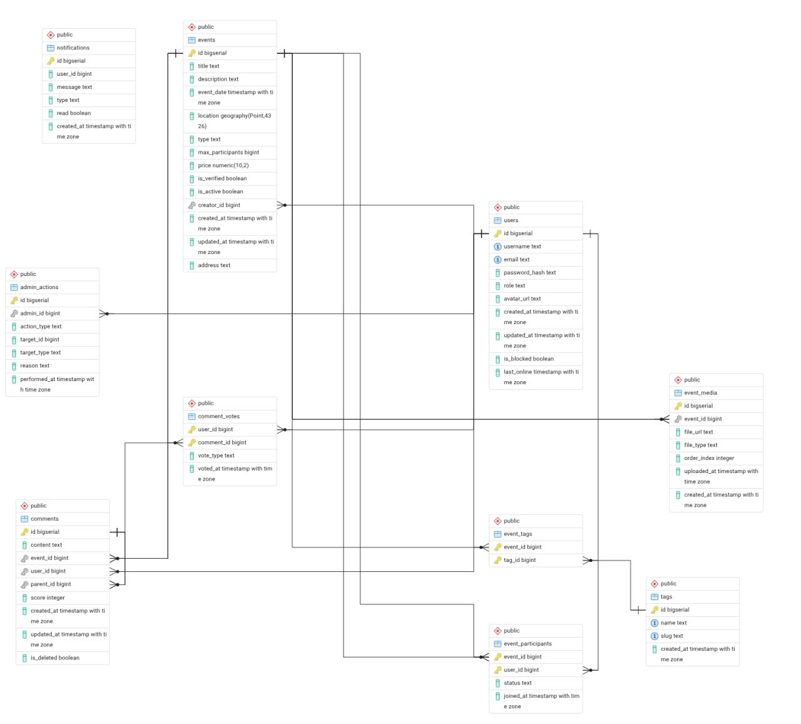

### **Проект: Маяк — Платформа для создания и обнаружения мероприятий с интеллектуальной картой**

**1. Цель проекта**
Разработка геоинформационного веб-приложения для анонсирования, поиска и организации мероприятий, где ключевым элементом взаимодействия является интерактивная карта с "пагинацией по масштабу". Платформа предоставляет разные возможности для незарегистрированных, зарегистрированных и верифицированных пользователей, а также администраторов, и включает систему комментирования с древовидной структурой.

**2. Описание продукта**
Маяк — это сервис, позволяющий пользователям находить события (концерты, выставки, встречи, мастер-классы и т.д.) на карте. Основная "фишка" — пагинация по масштабу меток мероприятий на карте, которая визуально объединяет близко расположенные точки при отдалении и показывает их количество. Каждое мероприятие имеет детальную страницу с медиа-контентом. Социальный аспект обеспечивается системой комментариев, аналогичной Reddit (вложенные ветки).

**3. Основные роли пользователей**

*   **Гость (Незарегистрированный пользователь):**
    *   Просмотр карты мероприятий с пагинацией по масштабу.
    *   Поиск и фильтрация мероприятий (по дате, типу, тегам).
    *   Просмотр детальной страницы любого мероприятия (описание, фото, комментарии).
    *   Возможность регистрации и входа.

*   **Зарегистрированный пользователь (Участник):**
    *   Все возможности Гостя.
    *   Создание новых мероприятий с привязкой к карте.
    *   Запись на участие в мероприятиях (кнопка "Я пойду").
    *   Написание комментариев и ответов в ветках обсуждений мероприятий.
    *   Редактирование и удаление своих мероприятий и комментариев.

*   **Администратор:**
    *   Полный доступ к модерации: удаление любых мероприятий, комментариев.
    *   Просмотр списка всех зарегистрированных пользователей и их данных.

**4. Детальные функциональные требования**

**4.1. Модуль карты (Ядро системы):**
*   Интеграция картографического API (например, Яндекс.Карты)
*   **"Пагинация по масштабу"**
    *   При максимальном приближении отображаются все отдельные метки мероприятий.
    *   При отдалении карты близко расположенные метки автоматически объединяются в **один кластер*.
    *   На общей метке отображается **число** объединенных мероприятий.
    *   При клике на кластер карта приближается к области, охватывающей эти мероприятия, и кластер "распадается" на отдельные метки или подкластеры.

**4.2. Модуль мероприятий:**
*   **Создание/Редактирование мероприятия:**
    *   Обязательные поля: название, дата и время, тип, описание, точка на карте.
    *   Загрузка нескольких фотографий мероприятия и места проведения.
    *   Опциональные поля: максимальное число участников, цена, теги, ссылки на соцсети.
*   **Карточка мероприятия:**
    *   Детальное отображение всех данных.
    *   Галерея фотографий.
    *   Счетчик записавшихся участников.
    *   Кнопка "Я пойду" / "Отменить запись" (для авторизованных).

**4.3. Модуль комментариев (Reddit-like):**
*   Возможность оставить корневой комментарий к мероприятию.
*   Возможность ответа на любой комментарий, создавая **ветвь**.
*   Отображение комментариев в виде **древовидной структуры** с возможностью свернуть/развернуть ветку.
*   Система голосов для комментариев.

**4.4. Модуль пользователей и безопасности:**
*   Регистрация/авторизация
*   **Личный кабинет:** профиль, "Мои мероприятия" (созданные и запланированные), мои комментарии.

**4.5. Административная панель:**
*   Сбор статистики с общей статистикой. (Кол-во участников мероприятия, создатель мероприятия, процент интереса мероприятия, кол-во комментариев, общей кол-во пользователей, пользователи онлайн)
	* Процент интереса мероприятия вычисляется как отношение все пользователей к записавшимся на мероприятие, умноженное на 100%.
*   Управление пользователями (просмотр отдельного профиля пользователя, блокировка, просмотр списка всех пользователей).
*   Панель верификации: список мероприятий с описанием и создателем, кнопки "Подтвердить"/"Отклонить".
*   Модерация мероприятий (просмотр, удаление)
*   Модерация комментариев (просмотр,  удаление).

**5. Технологический стек 
*   **Бэкенд:** Go.
*   **Фронтенд:** Angular.  Библиотеки для карт: Яндекс.Карты.
*   **База данных:** PostgreSQL (с PostGIS)

Схема Базы данных:

Проекту есть куда развиваться, это подключение miniO для хранения изображений для карточек мероприятий, подключение (возможно) системы рекомендаций, и так далее. 